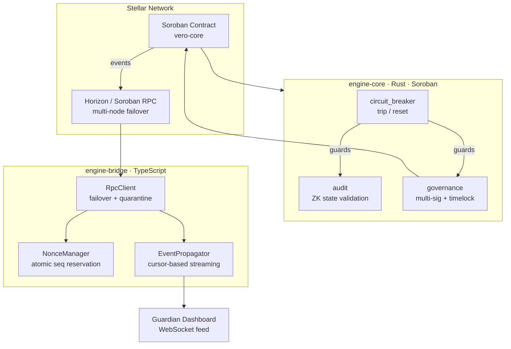

# vero-core-engine

> **Protocol-grade integration layer for the Stellar / Vero ecosystem.**
> ZK-ready · Audit-first · Circuit-protected · Multi-sig governed

[](LICENSE)
[](https://stellar.org)
[](DEVELOPMENT_ROADMAP.md)

---

## Protocol Value Proposition

`vero-core-engine` is the secure, audit-ready bridge that unifies:

- **Soroban smart contracts** (vero-core-contracts)
- **Event relayer service** (vero-relayer-service)
- **Guardian dashboard** (real-time monitoring + governance)

into a single, cohesive integration layer.

| Property | Mechanism |
|---|---|
| **Integrity** | ZK-audit hooks validate every state transition via chained hash commitments |
| **Liveness** | RPC failover across multiple Horizon/Soroban nodes; no single point of failure |
| **Governance** | Multi-sig proposals with time-lock + veto window before execution |
| **Safety** | Emergency circuit-breaker halts all state transitions instantly |
| **Auditability** | Structured event propagation with cursor-based replay to guardian dashboard |

---

## Architecture



```
┌─────────────────────────────────────────────────────────────────┐
│                        Stellar Network                          │
│   ┌──────────────┐  events   ┌──────────────────────────────┐   │
│   │  vero-core   │ ────────► │ Horizon / Soroban RPC nodes  │   │
│   │  (Soroban)   │           └─────────────┬────────────────┘   │
│   └──────────────┘                         │                    │
└────────────────────────────────────────────│────────────────────┘
                                             │ failover pool
                          ┌──────────────────▼──────────────────┐
                          │         engine-bridge (TS)          │
                          │  ┌────────────┐  ┌───────────────┐  │
                          │  │ RpcClient  │  │ NonceManager  │  │
                          │  │ (failover) │  │ (atomic seq)  │  │
                          │  └─────┬──────┘  └───────────────┘  │
                          │  ┌─────▼──────────────────────────┐  │
                          │  │ EventPropagator (cursor-based) │  │
                          │  └─────────────────────┬──────────┘  │
                          └────────────────────────│─────────────┘
                                                   │ EngineEvent
                          ┌────────────────────────▼─────────────┐
                          │       Guardian Dashboard              │
                          │  WebSocket feed · Anomaly detection   │
                          └───────────────────────────────────────┘
                          ┌──────────────────────────────────────┐
                          │       engine-core (Rust/Soroban)     │
                          │  audit::validate_transition          │
                          │  governance::approve / execute       │
                          │  circuit_breaker::trip / reset       │
                          └──────────────────────────────────────┘
```

---

## Repository Layout

```
vero-core-engine/
├── engine-core/            # Rust — ZK audit, multi-sig governance, circuit-breaker
│   ├── Cargo.toml
│   └── src/
│       ├── lib.rs
│       ├── types.rs        # StateCommitment, Proposal, BreakerState
│       ├── audit.rs        # ZK state-commitment validation
│       ├── governance.rs   # Multi-sig proposals with time-lock
│       └── circuit_breaker.rs
├── engine-bridge/          # TypeScript — RPC failover, nonce, event streaming
│   ├── package.json
│   ├── tsconfig.json
│   ├── jest.config.js
│   └── src/
│       ├── index.ts
│       ├── rpc-client.ts   # Failover across Horizon/Soroban nodes
│       ├── nonce-manager.ts # Atomic sequence-number reservation
│       ├── event-propagator.ts # Soroban event → dashboard stream
│       └── __tests__/
├── docs/
│   ├── adrs/               # Architecture Decision Records
│   └── incidents/          # Post-incident reports
├── security/               # Symlink → SECURITY.md + incident artefacts
├── .github/
│   ├── ISSUE_TEMPLATE/
│   │   └── feature_request.md
│   └── workflows/          # CI/CD (add as needed)
├── SECURITY.md
├── CONTRIBUTING.md
├── DEVELOPMENT_ROADMAP.md
├── BUILD_ENGINE.sh         # One-shot scaffold + build + health-check
└── Cargo.toml              # Workspace root
```

---

## Zero-to-Code Deployment Guide

### Prerequisites

| Tool | Minimum Version |
|------|----------------|
| Rust + Cargo | 1.78 (stable) |
| Node.js | 20 LTS |
| Stellar CLI | 0.9 |
| Docker | 24 |
| `gh` CLI | 2.x |

### 1. Clone and scaffold

```bash
git clone https://github.com/your-org/vero-core-engine.git
cd vero-core-engine
./BUILD_ENGINE.sh scaffold
```

### 2. Configure environment

```bash
cp .env.example .env
# Set: STELLAR_NETWORK, RPC_URLS (comma-separated), SIGNING_KEY, GUARDIAN_ADDRESS
```

### 3. Start local Soroban validator

```bash
docker compose up -d stellar-validator
# Wait for RPC readiness:
until curl -sf http://localhost:8000/health; do sleep 2; done
```

### 4. Build all engine components

```bash
./BUILD_ENGINE.sh build
# Compiles engine-core (Rust) and engine-bridge (TypeScript)
```

### 5. Deploy contracts

```bash
stellar contract build   # builds vero-core WASM
stellar contract deploy --wasm target/wasm32-unknown-unknown/release/vero_core.wasm \
  --network testnet --source $SIGNING_KEY
# Export the returned contract ID:
export CONTRACT_ID=<returned-id>
```

### 6. Initialise engine-core on-chain

```bash
# Initialise governance (3-of-5 multi-sig, 720-ledger time-lock)
stellar contract invoke --id $CONTRACT_ID -- init_governance \
  --signers "$SIGNER1,$SIGNER2,$SIGNER3,$SIGNER4,$SIGNER5" \
  --threshold 3

# Initialise circuit-breaker guardian set
stellar contract invoke --id $CONTRACT_ID -- init_breaker \
  --guardians "$GUARDIAN_ADDRESS"
```

### 7. Start engine-bridge

```bash
cd engine-bridge
RPC_URLS="$RPC_URLS" CONTRACT_ID="$CONTRACT_ID" \
  node dist/index.js
# Subscribes to events, fans out to dashboard via EventPropagator
```

### 8. System health check

```bash
./BUILD_ENGINE.sh health
# Expected: ✓ on all components
```

---

## engine-grpc API Reference

### `EngineClient(address: string)`
Typed gRPC client. All streaming methods return async iterators.

```typescript
import { EngineClient } from "@vero/engine-grpc";

const client = new EngineClient("localhost:50051");

// Stream all events for a contract
for await (const event of client.watchEvents({ contract_id: CONTRACT_ID })) {
  console.log(event.id, event.ledger);
}

// Stream ZK state-commitment updates only
for await (const update of client.watchZkState()) {
  console.log(update.event_id, update.raw);
}

// Unary health check
const health = await client.getHealth();
// { status: "ok", live_rpc_nodes: 2, cursor: "...", uptime_sec: 120 }

client.close();
```

---

## engine-core API Reference

### `audit::validate_transition(env, commitment, payload)`
Validates a `StateCommitment` against the chain of prior hashes. Panics on replay or hash mismatch.

### `governance::propose(env, proposal) → id`
Submits a proposal. Proposer must be in the signer set.

### `governance::approve(env, signer, proposal_id)`
Records a signer approval (requires auth). Time-lock starts when threshold is first met.

### `governance::execute(env, proposal_id) → Proposal`
Executes after threshold approvals + time-lock expiry.

### `circuit_breaker::trip(env, guardian)`
Halts all state transitions. Emits `CB/tripped` event.

### `circuit_breaker::reset(env, guardian)`
Resumes normal operation. Emits `CB/reset` event.

---

## engine-bridge API Reference

### `RpcClient(urls: string[])`
Round-robin RPC with 30-second quarantine on failed endpoints.

```typescript
const rpc = new RpcClient([
  "https://soroban-testnet.stellar.org",
  "https://rpc-testnet.stellar.org",
]);
const ledger = await rpc.call(s => s.getLatestLedger());
```

### `NonceManager(rpc: RpcClient)`
Serialises sequence-number reservation per account. Returns sequences for release on failure.

```typescript
const nm  = new NonceManager(rpc);
const seq = await nm.reserve("GACCOUNT…");
try {
  // build + submit tx with seq
} catch {
  nm.release("GACCOUNT…", seq);
}
```

### `EventPropagator(rpc, contractId, cursorOverride?)`
Long-poll event streaming with cursor persistence for replay-on-restart.

```typescript
const ep = new EventPropagator(rpc, CONTRACT_ID, process.env.EVENT_CURSOR);
ep.onEvent(async (event) => {
  // push to dashboard WebSocket, write to DB, etc.
});
ep.start();
// On shutdown: persist ep.getCursor() to resume cleanly
```

---

## Project Status

See [DEVELOPMENT_ROADMAP.md](DEVELOPMENT_ROADMAP.md) for the full milestone tracker.

**Engine layer (this repo):**
- [x] engine-core: ZK audit, multi-sig governance, circuit-breaker
- [x] engine-bridge: RPC failover, nonce management, event propagation
- [x] BUILD_ENGINE.sh automation
- [x] SECURITY.md with incident response playbooks
- [x] GitHub issue template (Gold Standard)
- [x] CI/CD workflow (GitHub Actions)
- [x] Docker Compose for full local stack
- [x] gRPC streaming API

---

## Security

See [SECURITY.md](SECURITY.md) for the vulnerability disclosure policy, incident response playbooks, and safe-harbor commitment.

---

## License

Apache-2.0 — see [LICENSE](LICENSE).
